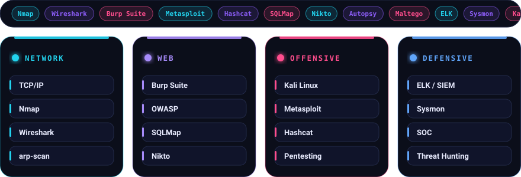
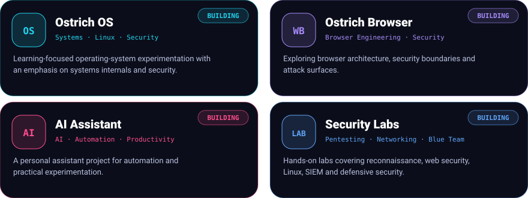

 

 

### 👋 About Me

I'm **Ankur Yadav**, a cybersecurity-focused learner building practical skills across **network security, penetration testing, Linux, SOC, threat hunting and digital forensics**.

### 🎯 Current Focus

- 🔴 **Offensive Security** — Recon · Web Pentesting · Burp Suite · Metasploit
- 🔵 **Defensive Security** — SOC · SIEM · ELK · Sysmon · Threat Hunting
- 🌐 **Networking** — TCP/IP · Nmap · Wireshark · Network Analysis
- 🔎 **DFIR / OSINT** — Autopsy · Digital Forensics · Recon
- 🐧 **Linux** — Kali · Arch · Bash · System Administration

> **Learn → Lab → Analyze → Defend → Secure**

<picture>
  
</picture>

  

